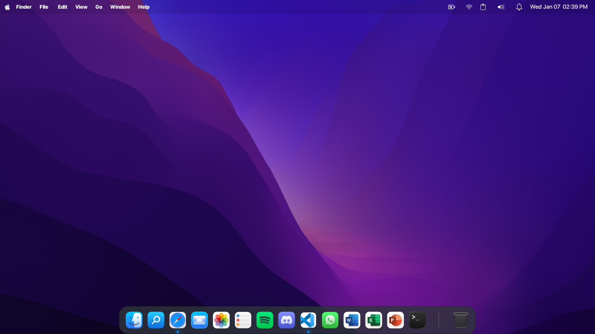

# Arch Linux XFCE Dotfiles

Personal XFCE desktop configuration.

## Screenshot



## Includes
- XFCE4 panel & window manager
- GTK theme config
- Picom compositor
- Plank dock
- Starship prompt
- Thunar file manager

## Usage
```bash
git clone https://github.com/USERNAME/arch-xfce-dotfiles.git
cp -r arch-xfce-dotfiles/* ~/.config/
